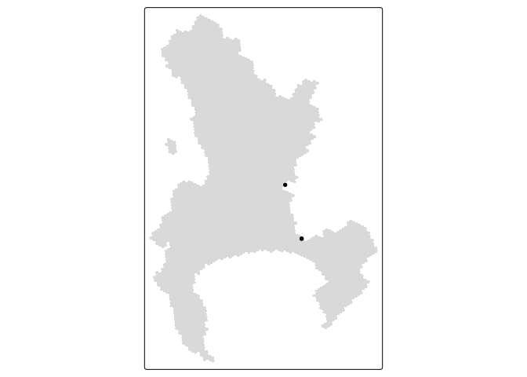
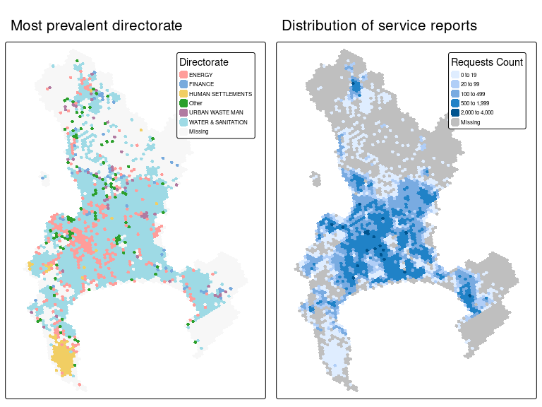
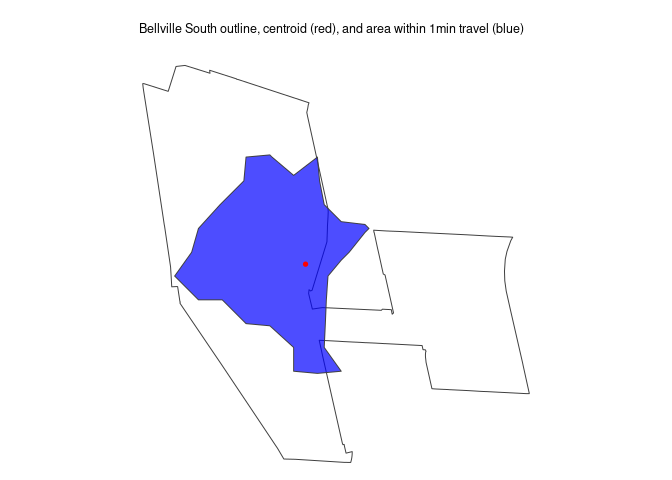
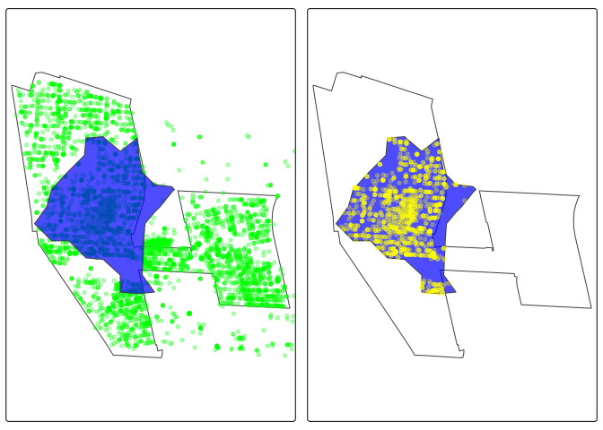
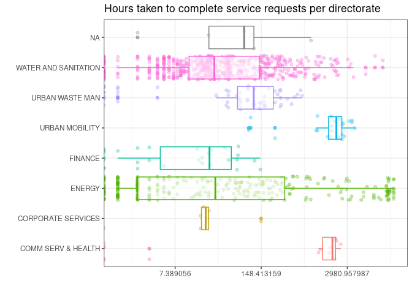

# J-PAL & CCT Data Engineer Code Challenge
Tivan
2025-08-20

<div align="center">


</div>

# Introduction

The purpose of this document is to walk through my solutions to the
[Code
Challenge](https://github.com/cityofcapetown/ds_code_challenge/tree/j-pal-data-engineer)
for the Data Engineer position at J-PAL Africa. The solutions are
divided into three sections, each with a corresponding script.
<a href="#sec-extraction" class="quarto-xref">Section 2.1</a>
corresponds to `1_s3_select.R` which retrieves data from AWS,
<a href="#sec-initial" class="quarto-xref">Section 2.2</a> corresponds
to `2_initial_data_transformation.R` which uses spatial joins to combine
two datasets, and
<a href="#sec-further" class="quarto-xref">Section 2.3</a> corresponds
to `3_further_data_transformation.R` which applies spatial filtering,
adds additional data to enrich the dataset, and anonymises data where
necessary. All scripts should be able to run independently from one
another (where a file was downloaded in one, it will be available to the
next which will skip retrieval if the file is detected locally).

> I recommend using the `setwd()` function to set the directory that was
> cloned from Github (`ds_code_challenge`) as the working directory at
> the start of every script **or** to open RStudio by double clicking on
> the `.Rproj` file (which will automatically set it as your working
> directory. Retrieve the repository by running
> `git clone https://github.com/tivanl/ds_code_challenge.git`.

# Challenge Solutions

The packages below need to be installed to enable the code in the
scripts to run. There are some functions that use `system()` to make
calls directly to the operating system. **The code was written using
Linux (Ubuntu 22.04) and is not compatible with Windows**.

``` r
# a vector containing the names of all the packages used in the document
req_pkg <- c(
  "paws",
  "httr2",
  "tictoc",
  "logger",
  "glue",
  "sf",
  "jsonlite",
  "tmap",
  "furrr",
  "parallel",
  "janitor",
  "glue",
  "h3jsr",
  "osrm",
  "readODS",
  "digest",
  "lwgeom",
  "tidyverse"
)
# vector indicating whether the packages in req_pkg are installed
filter_vec <- !req_pkg %in% installed.packages()[,"Package"]
# install those that have not been installed
if(sum(filter_vec) > 0) walk(pkg[filter_vec], ~install.packages(.x, Ncpus = 5))

library(paws)
library(httr2)
library(tictoc)
library(logger)
library(glue)
library(sf)
library(jsonlite)
library(tmap)
library(furrr)
library(parallel)
library(janitor)
library(glue)
library(h3jsr)
library(osrm)
library(readODS)
library(digest)
library(lwgeom)
library(tidyverse)
```

Besides the packages read in above, I also define custom function which
can be found in `scripts/helpers`. I source them in the code chunk below
and they can be found in
<a href="#sec-appendix" class="quarto-xref">Section 3</a>.

``` r
source("scripts/helpers/download_cpt_s3_data.R")
source("scripts/helpers/st_join_contains.R")
source("scripts/helpers/load_cpt_suburbs.R")
source("scripts/helpers/download_file.R")
```

## Data extraction

The code below sets up a client for AWS S3 service. Note that the
following environment variables have to be set before running the code:
`AWS_ACCESS_KEY_ID`, `AWS_SECRET_ACCESS_KEY`, and `AWS_REGION`. The `s3`
client’s operations can be called using syntax like `s3$operation()`.

``` r
# set up the s3 connection (the credentials should be saved in  .Renviron)
s3 <- paws::s3(
  config = list(
    credentials = list(
      creds = list(
        access_key_id = Sys.getenv("AWS_ACCESS_KEY_ID"),
        secret_access_key = Sys.getenv("AWS_SECRET_ACCESS_KEY")
      )
    ),
    region = Sys.getenv("AWS_REGION")
  )
)
```

The code below uses AWS S3 Select to retrieve only resolution 8 polygons
from `city_hex_polygons_8_10_filter_8.geojson`.

``` r
# specify the file information for extraction 
bucket_name <- "cct-ds-code-challenge-input-data"
file_name <- "city-hex-polygons-8-10.geojson"
# specify the query to use for selecting only resolution 8 polygons
query <- "SELECT s.* FROM s3object[*].features[*] s WHERE s.properties.resolution = 8"

# start timer for data retrieval operation
tic("Retrieving resolution 8 data from city_hex_polygons_8_10_filter_8.geojson took")
# use the select object content operation to retrieve the data from the file
hex_8_stream <- s3$select_object_content(
  Bucket = bucket_name,
  Key = file_name,
  Expression = query,
  ExpressionType = "SQL",
  InputSerialization = list(
    # geojsons are jsons so we can use the json format
    JSON = list(Type = "DOCUMENT"),
    CompressionType = "NONE"
  ),
  OutputSerialization = list(
    JSON = list(RecordDelimiter = "\n")
  )
)

# AWS S3 Select streams the response (because the size of the request is 
# unknown). The code below retrieves all the chunks from the response
hex_8_events <- hex_8_stream$Payload(
  function(x) {
    
    if (!is.null(x$Records)){
      output <- x$Records$Payload
      
      return(x)
      
    }
  }
)

# Define a function that can be used to loop over the events to extract text 
# from the raw response
extract_from_payload <- function(raw){
  
  if(is.raw(raw$Records$Payload)){
    return_char <- rawToChar(raw$Records$Payload)
  } else{
    return_char <- ""
  }
  
  return(return_char)
  
}

# extract all of the valid raw data that was streamed
map_chr(
  hex_8_events,
  extract_from_payload
) %>% 
  # collapse into a single string
  str_c(collapse = "") %>% 
  # remove trailing white space
  str_trim() %>% 
  # save the cleaned data in the appropriate file location
  writeLines(text = ., con = "data/city_hex_polygons_8_10_filter_8.geojson")

# end timer for the operation
toc()
```

    Retrieving resolution 8 data from city_hex_polygons_8_10_filter_8.geojson took: 3.099 sec elapsed

The code below validates that the polygons retrieved using S3 Select
match the data in `city_hex_polygons_8_10_filter_8.geojson`.

``` r
# read S3 selected data in from where it was saved in the previous code chunk
cpt_hex_filtered_8 <- st_read("data/city_hex_polygons_8_10_filter_8.geojson")
```

    Reading layer `city_hex_polygons_8_10_filter_8' from data source 
      `/home/tivan/Documents/projekte/ds_code_challenge/data/city_hex_polygons_8_10_filter_8.geojson' 
      using driver `GeoJSONSeq'
    Simple feature collection with 3832 features and 4 fields
    Geometry type: POLYGON
    Dimension:     XY
    Bounding box:  xmin: 18.29788 ymin: -34.36485 xmax: 19.01255 ymax: -33.46401
    Geodetic CRS:  WGS 84

``` r
# ensure the file to validate against is downloaded
tic("Time taken to download data/city-hex-polygons-8.geojson (or check if already downloaded)")
hex_polygons_8_location <- "https://cct-ds-code-challenge-input-data.s3.af-south-1.amazonaws.com/city-hex-polygons-8.geojson" 
#  the download_cpt_s3_data function is sourced at the start of the document 
download_cpt_s3_data(hex_polygons_8_location)
```

    data/city-hex-polygons-8.geojson

``` r
toc()
```

    Time taken to download data/city-hex-polygons-8.geojson (or check if already downloaded): 0.697 sec elapsed

``` r
# read the file in against which to validate
city_polygons_8 <- st_read("data/city-hex-polygons-8.geojson")
```

    Reading layer `city-hex-polygons-8' from data source 
      `/home/tivan/Documents/projekte/ds_code_challenge/data/city-hex-polygons-8.geojson' 
      using driver `GeoJSON'
    Simple feature collection with 3832 features and 3 fields
    Geometry type: POLYGON
    Dimension:     XY
    Bounding box:  xmin: 18.29788 ymin: -34.36485 xmax: 19.01255 ymax: -33.46401
    Geodetic CRS:  WGS 84

``` r
# validate that the two files are similar ---------------------------------

tic("Validation of city-hex-polygons-8-10 (res 8) against city-hex-polygons-8")
# get the number of rows in the larger file that are not contained in the smaller
# file
rows_8to10_not_in_8 <- cpt_hex_filtered_8 %>% 
  filter(!index %in% city_polygons_8$index) %>% 
  nrow()

# get the number of rows in the smaller file that are not contained in the larger
# file
rows_8_not_in_8to10 <- city_polygons_8 %>% 
  filter(!index %in% cpt_hex_filtered_8$index) %>% 
  nrow()

# An exact match requires both values to be zero
if(rows_8_not_in_8to10 == 0 & rows_8to10_not_in_8 == 0){
  log_info(
    "Exact match between city-hex-polygons-8 & city-hex-polygons-8-10 (res 8)"
  )
} else{
  log_info(
    glue("city-hex-polygons-8-10 (res 8) has {rows_8to10_not_in_8} rows that don't match city-hex-polygons-8")
  )
  log_info(
    glue("city-hex-polygons-8 has {rows_8_not_in_8to10} rows that don't match city-hex-polygons-8-10 (res 8)")
  )
}

# report the time consumed by the operation
toc()
```

    Validation of city-hex-polygons-8-10 (res 8) against city-hex-polygons-8: 0.009 sec elapsed

``` r
# print the dataframe
cpt_hex_filtered_8
```

    Simple feature collection with 3832 features and 4 fields
    Geometry type: POLYGON
    Dimension:     XY
    Bounding box:  xmin: 18.29788 ymin: -34.36485 xmax: 19.01255 ymax: -33.46401
    Geodetic CRS:  WGS 84
    First 10 features:
                 index centroid_lat centroid_lon resolution
    1  88ad361801fffff    -33.85943     18.67784          8
    2  88ad361803fffff    -33.85570     18.66877          8
    3  88ad361805fffff    -33.85526     18.68596          8
    4  88ad361807fffff    -33.85153     18.67688          8
    5  88ad361809fffff    -33.86732     18.67881          8
    6  88ad36180bfffff    -33.86359     18.66973          8
    7  88ad36180dfffff    -33.86316     18.68692          8
    8  88ad361811fffff    -33.85613     18.65158          8
    9  88ad361813fffff    -33.85239     18.64250          8
    10 88ad361815fffff    -33.85196     18.65969          8
                             geometry
    1  POLYGON ((18.68119 -33.8633...
    2  POLYGON ((18.67211 -33.8595...
    3  POLYGON ((18.68931 -33.8591...
    4  POLYGON ((18.68023 -33.8554...
    5  POLYGON ((18.68215 -33.8712...
    6  POLYGON ((18.67307 -33.8674...
    7  POLYGON ((18.69027 -33.8670...
    8  POLYGON ((18.65492 -33.86, ...
    9  POLYGON ((18.64585 -33.8562...
    10 POLYGON ((18.66304 -33.8558...

## Initial Data Transformation

This section deals with the initial transformation of the service
request data. The code chunk below uses a custom defined function
(`download_cpt_s3_data`) which is sourced at the top of the document. It
checks whether the relevant file exists locally and downloads it in case
it does not exist.

``` r
# execute the download_cpt_s3_data function to retrieve the file if it doesn't 
# exist & provide the path if it does exist
tic("Time taken to retrieve sr_hex")
download_cpt_s3_data("https://cct-ds-code-challenge-input-data.s3.af-south-1.amazonaws.com/sr_hex.csv.gz")
```

    data/sr_hex.csv

``` r
download_cpt_s3_data("https://cct-ds-code-challenge-input-data.s3.af-south-1.amazonaws.com/sr.csv.gz")
```

    data/sr.csv

``` r
toc()
```

    Time taken to retrieve sr_hex: 19.061 sec elapsed

Once the required data is downloaded, we can read it in and prepare it
for the join. Combining the data will require performing a spatial join.
The code chunk below splits the data into two data frames.
`missing_geo_sr_12m` (missing latitude or longitude), contains the
unique identifier (`notification_number`) and a column called
`h3_level8_index` with all of its values set to zero (as instructed).
`notification_number` is used later on to join the indexed data back to
`service_requests_12m`. `geo_sr_12m` contains all of the rows that have
sufficient geolocation information.

``` r
# read in the service request data with the H3 hex indexes for the past 12 
# months
service_requests_12m <- read_csv("data/sr.csv") %>% 
  # exclude the first column, it is an unnamed row counter
  .[,-1]

# keep the rows with missing lat & long values separate from the geo join data
missing_geo_sr_12m <- service_requests_12m %>% 
  filter(is.na(latitude) & is.na(longitude)) %>% 
  # we only need to keep the notification_number as the unique ID
  select(notification_number) %>% 
  # set the index to zero as instructed
  mutate(h3_level8_index = "0")

# create an object with only non-missing coordinates 
geo_sr_12m <- service_requests_12m %>% 
  # select only the notification number as the unique ID
  select(notification_number, latitude, longitude) %>% 
  # filter out rows with missing geolocation
  filter(!is.na(latitude) & !is.na(longitude))

missing_geo_sr_12m
```

    # A tibble: 212,364 × 2
       notification_number h3_level8_index
       <chr>               <chr>          
     1 000400525315        0              
     2 000400527116        0              
     3 000400528840        0              
     4 000400530412        0              
     5 000400530772        0              
     6 000400535466        0              
     7 000400535474        0              
     8 000400544699        0              
     9 000400544754        0              
    10 000400544931        0              
    # ℹ 212,354 more rows

The code chunk below, transforms `geo_sr_12m` to a simple feature
collection and then performs a spatial join to retrieve the indexes of
the H3 polygons at resolution 8. `geo_sr_12m` has 729270 rows. I am
working on a machine with only 8GB of RAM, which means I have to opt for
memory efficiency rather than speed. It is possible to implement the
join in parallel which should reduce the computation time (on my machine
it actually takes longer). You can uncomment the relevant lines and
comment out the relevant ones to run the process in parallel.

``` r
# read in the polygons
city_hex_8 <- st_read("data/city-hex-polygons-8.geojson")
```

    Reading layer `city-hex-polygons-8' from data source 
      `/home/tivan/Documents/projekte/ds_code_challenge/data/city-hex-polygons-8.geojson' 
      using driver `GeoJSON'
    Simple feature collection with 3832 features and 3 fields
    Geometry type: POLYGON
    Dimension:     XY
    Bounding box:  xmin: 18.29788 ymin: -34.36485 xmax: 19.01255 ymax: -33.46401
    Geodetic CRS:  WGS 84

``` r
tic("Time consumed in conversion and spatial join")
# convert the lat & long points into point geometries
geom_point_values <- map2(
  geo_sr_12m$longitude,
  geo_sr_12m$latitude,
  ~st_point(c(.x, .y))
)

sf_sr_12m <- geo_sr_12m %>% 
  # it is important to check the CRS of the hex to ensure they match
  st_sf(geometry = geom_point_values, crs = 4326)

# iterating over 10 smaller dataframes is more memory efficient than performing 
# the join over the entire points dataframe. On my machine it is also faster due 
# to the computation spilling into swap memory.
# It is also faster than implementing it in parallel (but only because I am 
# limited to 8GB of memory). I implemented a parallel version over 5 instances
# but the excessive memory usage made it perform slower than the sequential 
# version.

# cl <- makePSOCKcluster(5)  # for parallel
# plan(cluster, workers = cl)  # for parallel

# perform a spatial join
geo_sr_12m_indexed <- sf_sr_12m %>% 
  # create an index to loop over
  mutate(
    row_num = 1:n(),
    row_num = row_num %% 10
  ) %>% 
  # split the dataframe into segments according to the index
  group_nest(row_num, .key = "points_df") %>% 
  # Add the polygons as a column in the dataframe (assists with using pmap). 
  # This will not be memory intensive, all elements of the list will merely
  # be pointers to the same dataframe containing the polygons
  mutate(
    polygons_df = list(city_hex_8)
  ) %>% 
  # now that the data segments have been create, drop the index
  select(-row_num) %>% 
  # iterate over the segments and bind the rows of the resulting sf dataframes.
  # Note that the st_join_contains function is defined in a separate file & 
  # sourced at the start of the document
  pmap_dfr(st_join_contains)  # comment out for parallel
  # future_pmap_dfr(st_join_contains)  # for parallel

# stopCluster(cl)  # for parallel

# display the time taken for the operation
toc()
```

    Time consumed in conversion and spatial join: 23.02 sec elapsed

``` r
# show that the indexes have been matched
geo_sr_12m_indexed %>% 
  glimpse()
```

    Rows: 729,267
    Columns: 2
    $ h3_level8_index     <chr> "88ad361801fffff", "88ad361801fffff", "88ad361801f…
    $ notification_number <chr> "001015471384", "001015475050", "001015536901", "0…

The code chunk below checks the joined records against the original data
to see if there were records that failed to join.

``` r
# There are 3 data points that don't comply with the geo join, what should the threshold be? 
failed_records <- geo_sr_12m %>% 
  filter(!notification_number %in% geo_sr_12m_indexed$notification_number)

# show the records that failed to match
failed_records 
```

    # A tibble: 3 × 3
      notification_number latitude longitude
      <chr>                  <dbl>     <dbl>
    1 001015950287           -34.0      18.8
    2 001016348681           -34.0      18.8
    3 001016488950           -33.9      18.7

``` r
# save a file to check which records couldn't match
saveRDS(failed_records, "output/failed_geo_join_records.rds")
```

I decided on a threshold of 0.1%. This means that if 0.1% of records
with geolocation failed to join, the script errors out. I don’t want the
script to error due to minor data quality issues (there are already over
200,000 rows without geolocation). I do want to make the user aware of
any possible systematic issues in the location values. I view 0.1% as a
low threshold for detecting systematic issues.

``` r
# If more than 0.1% of rows failed to join, throw an error and explain where the 
# failed records can be found.
# The 0.1% threshold was chosen to ensure a low threshold for detecting 
# systematic issues (not mere anomalies)
if(nrow(failed_records)/nrow(geo_sr_12m) > 0.001){
  log_error(
    glue(
      "THERE WERE {nrow(failed_records)} RECORDS THAT COULD NOT BE JOINED BASED ON COORDINATES
      ____THE 20 RECORD THRESHOLD HAS BEEN VIOLATED____
      FIND THE RECORDS THAT FAILED IN output/failed_geo_join_records.rds"
    )
  )
} else {
  # otherwise, let the user know how many records were not joined
  log_info(
    glue(
      "THERE WERE {nrow(failed_records)} RECORDS THAT COULD NOT BE JOINED BASED ON COORDINATES."
    )
  )
}
```

The map below shows that the three points that failed to join fall
slightly outside the bounds of the polygons for the city.

``` r
  tm_shape(city_hex_8) +
  tm_fill() +
  tm_shape(
    sf_sr_12m %>%
      filter(notification_number %in% failed_records$notification_number)
  ) +
  tm_dots() 
```



We can nonetheless obtain H3 resolution 8 index values for these three
point by using the `hrjsr` package. This package is a lightweight
wrapper that allows for interaction with the H3 API via its JavaScript
implementation.

``` r
# use the sf dataframe for the 12 month service reports
outside_cpt_h3 <- sf_sr_12m %>%
  # keep only the rows which were unable to join to the provided polygons
  filter(notification_number %in% failed_records$notification_number) %>%
  # use the point_to_cell function to obtain the h3 res 8 index value for each
  # point
  mutate(
    h3_level8_index = map_chr(geometry, ~point_to_cell(.x, res = 8))
  ) %>% 
  # keep only the notification_number and h3 index variables
  st_drop_geometry() %>% 
  select(
    notification_number, h3_level8_index
  )

outside_cpt_h3
```

    # A tibble: 3 × 2
      notification_number h3_level8_index
      <chr>               <chr>          
    1 001015950287        88ad36c629fffff
    2 001016348681        88ad36c629fffff
    3 001016488950        88ad361b51fffff

After a successful join and obtaining values for the points outside of
the original city polygon bounds, we can combine everything into a
single index lookup dataframe (`complete_indexed`). The index values are
joined to the original 12 month service request data to enable
validation (`all_indexed`).

``` r
# combine records without coordinates and those with matched
complete_indexed <- bind_rows(
  geo_sr_12m_indexed, 
  missing_geo_sr_12m, 
  outside_cpt_h3
) 

# join to the original service request data
all_indexed <- service_requests_12m %>% 
  left_join(complete_indexed)
# display a snippet of the data
all_indexed %>% 
  glimpse()
```

    Rows: 941,634
    Columns: 16
    $ notification_number  <chr> "000400583534", "000400555043", "000400589145", "…
    $ reference_number     <dbl> 9109491785, 9108995239, 9109614461, 9108601346, N…
    $ creation_timestamp   <dttm> 2020-10-07 04:55:18, 2020-07-09 14:08:13, 2020-1…
    $ completion_timestamp <dttm> 2020-10-08 13:36:35, 2020-07-14 12:27:01, 2020-1…
    $ directorate          <chr> "URBAN MOBILITY", "URBAN MOBILITY", "URBAN MOBILI…
    $ department           <chr> "Roads Infrastructure Management", "Roads Infrast…
    $ branch               <chr> "RIM Area Central", "RIM Area East", "RIM Area Ea…
    $ section              <chr> "District: Blaauwberg", "District : Somerset West…
    $ code_group           <chr> "TD Customer complaint groups", "TD Customer comp…
    $ code                 <chr> "Pothole&Defect Road Foot Bic Way/Kerbs", "Manhol…
    $ cause_code_group     <chr> "Road (RCL)", "Road (RCL)", "Road (RCL)", "Road M…
    $ cause_code           <chr> "Wear and tear", "Vandalism", "Vandalism", "Wear …
    $ official_suburb      <chr> "MONTAGUE GARDENS", "SOMERSET WEST", "STRAND", "R…
    $ latitude             <dbl> -33.87284, -34.07892, -34.10224, -33.92002, -33.9…
    $ longitude            <dbl> 18.52249, 18.84894, 18.82112, 18.60721, 18.45376,…
    $ h3_level8_index      <chr> "88ad360225fffff", "88ad36d5e1fffff", "88ad36d437…

The final step in this section is validation. The chunk below compares
the joined indexes data (`all_indexed`) with the `sr_hex.csv` file that
was provided. An `anti_join` across all variables, indicates a perfect
match by returning an empty dataframe.

``` r
# check against original file to see if they match
measure_file <- read_csv("data/sr_hex.csv")

# display a snippet of the data
measure_file
```

    # A tibble: 941,634 × 16
       notification_number reference_number creation_timestamp  completion_timestamp
       <chr>                          <dbl> <dttm>              <dttm>              
     1 000400583534              9109491785 2020-10-07 04:55:18 2020-10-08 13:36:35 
     2 000400555043              9108995239 2020-07-09 14:08:13 2020-07-14 12:27:01 
     3 000400589145              9109614461 2020-10-27 08:21:59 2020-10-28 15:48:15 
     4 000400538915              9108601346 2020-03-19 04:36:06 2021-03-29 18:34:19 
     5 000400568554                      NA 2020-08-25 07:48:42 2020-08-31 06:41:13 
     6 000400556029              9109002875 2020-07-11 08:34:37 2020-07-21 10:35:53 
     7 000400588369                      NA 2020-10-23 08:33:48 2020-10-26 12:16:49 
     8 000400549080                      NA 2020-06-17 13:46:11 2020-11-24 12:26:09 
     9 000400599701              9109844606 2020-12-04 06:30:50 2020-12-14 10:53:52 
    10 000400569986                      NA 2020-08-28 11:37:53 2020-08-28 14:17:35 
    # ℹ 941,624 more rows
    # ℹ 12 more variables: directorate <chr>, department <chr>, branch <chr>,
    #   section <chr>, code_group <chr>, code <chr>, cause_code_group <chr>,
    #   cause_code <chr>, official_suburb <chr>, latitude <dbl>, longitude <dbl>,
    #   h3_level8_index <chr>

``` r
# only the three records that could not be spatially joined, do not match 
# (their indexes differ from the validation data)
all_indexed %>% 
  anti_join(measure_file)
```

    # A tibble: 0 × 16
    # ℹ 16 variables: notification_number <chr>, reference_number <dbl>,
    #   creation_timestamp <dttm>, completion_timestamp <dttm>, directorate <chr>,
    #   department <chr>, branch <chr>, section <chr>, code_group <chr>,
    #   code <chr>, cause_code_group <chr>, cause_code <chr>,
    #   official_suburb <chr>, latitude <dbl>, longitude <dbl>,
    #   h3_level8_index <chr>

`all_indexed` can be used to visualise the spatial distribution of
service reports and the most prevalent directorate reported to per area.

``` r
tmap_mode("plot")

map_data <- all_indexed %>%
  count(
    h3_level8_index, directorate,
    name = "sr_count"
  ) %>% 
  group_by(h3_level8_index) %>% 
  mutate(
    total_sr_poly = sum(sr_count)
  ) %>% 
  arrange(desc(sr_count)) %>% 
  filter(1:n() == 1) %>% 
  group_by(directorate) %>% 
  mutate(
    prevalence = n(),
    directorate = ifelse(prevalence < 40, "Other", directorate),
    directorate = gsub("AND", "&", directorate),
    directorate = gsub("MANAGEMENT", "MAN", directorate)
  ) %>% 
  # count(h3_level8_index) %>% arrange(-n)
  left_join(
    city_hex_8,
    .,
    by = join_by(index == h3_level8_index)
  ) 


map_directorate <-
  map_data %>% 
  tm_shape() +
  tm_fill(
    "directorate",
      title = "Directorate"
  ) +
  tm_title("Most prevalent directorate") +
  tm_layout(
    legend.position = c("right", "top"),
    legend.text.size = 0.5
  )  

map_prevalence <- map_data %>% 
  tm_shape() +
  tm_fill(
    "total_sr_poly",
    breaks = c(0, 20, 100, 500, 2000, 4000),
    title = "Requests Count"
  ) +
  tm_title("Distribution of service reports") +
  tm_layout(
    legend.position = c("right", "top"),
    legend.text.size = 0.5
  ) 

tmap_arrange(map_directorate, map_prevalence, ncol = 2)
```



## Further Data Transformation

This section deals with geospatial manipulation, joining datasets by
temporal variables, and data anonymisation.

### Bellville subsample

In this section, a subsample of the service request are obtained by
filtering out the requests that are not within 1 min of the Bellville
South official suburb. This is done by using a shape file containing the
offical suburbs of the City of Cape Town. The Bellville South polygon is
used to obtain its centroid, following which the Open Street Maps API is
used to obtain a polygon that represents the area which is 1 min from
the centroid. A spatial join is performed to identify which service
reports fall within this area.

The code chunk below loads the necessary data. `load_cpt_suburbs` is a
custom function sourced at the start of the document. It checks whether
the shape file is available locally, downloads it if it isn’t and
returns the shape file loaded into R as an `sf` object.

``` r
# load the service request data (indexed) and the polygons vector data
sr_hex_df <- read_csv("data/sr_hex.csv") %>% 
  # the data without spatial info are not necessary
  filter(!is.na(latitude) & !is.na(longitude))

# load the polygons
cpt_polygons_8 <- st_read("data/city-hex-polygons-8.geojson")
```

    Reading layer `city-hex-polygons-8' from data source 
      `/home/tivan/Documents/projekte/ds_code_challenge/data/city-hex-polygons-8.geojson' 
      using driver `GeoJSON'
    Simple feature collection with 3832 features and 3 fields
    Geometry type: POLYGON
    Dimension:     XY
    Bounding box:  xmin: 18.29788 ymin: -34.36485 xmax: 19.01255 ymax: -33.46401
    Geodetic CRS:  WGS 84

``` r
# download & load the municipal area shape file for cpt using the function 
# sourced at the top of the script (skips download if locally present)
tic("Time taken to load the suburb shape file")
cpt_offcial_suburb_shp <- load_cpt_suburbs()
```

    Reading layer `Official_Planning_Suburbs' from data source 
      `/home/tivan/Documents/projekte/ds_code_challenge/data/Official_Planning_Suburbs/Official_Planning_Suburbs.shp' 
      using driver `ESRI Shapefile'
    Simple feature collection with 778 features and 4 fields
    Geometry type: MULTIPOLYGON
    Dimension:     XY
    Bounding box:  xmin: 2037976 ymin: -4077115 xmax: 2115607 ymax: -3958026
    Projected CRS: WGS 84 / Pseudo-Mercator

``` r
toc()
```

    Time taken to load the suburb shape file: 6.927 sec elapsed

The code chunk below obtains the centroid of Bellville South.

``` r
# isolate the bellville South polygon
bellville_shp <- cpt_offcial_suburb_shp %>% 
  filter(OFC_SBRB_N == "BELLVILLE SOUTH")

# select the polygon for Bellville South and determine the centroid
tic("Time taken to derive the centroid of Bellville South")
belville_centroid <- bellville_shp %>% 
  .$geometry %>% 
  st_centroid() 
toc()
```

    Time taken to derive the centroid of Bellville South: 0.005 sec elapsed

The code chunk below obtains the area reachable within 1 min from the
centroid using the `osrmIsochrone` function. It also visualises the
process in a plot that show the Bellville South outline, its centroid,
and the 1 min reachable area from the centroid.

``` r
# Determine the area which is reachable within 1 min or less from the centroid
tic("Time taken to determine the 1 min reachable area from the centroid")
centroid_buff_1min <- belville_centroid %>% 
  # transform to the appropriate coordinate reference system to attain lat-long
  st_transform(4326) %>% 
  # extract a vector containing the long and lat values for the centroid
  st_coordinates() %>% 
  # use the OSM API to retrieve the area within 1 min from the centroid
  osrmIsochrone(breaks = 1, res = 30) %>% 
  # make sure the polygon is valid for further use
  st_make_valid()
toc()
```

    Time taken to determine the 1 min reachable area from the centroid: 16.599 sec elapsed

``` r
# visualise the process using the Bellville South shape
cpt_offcial_suburb_shp %>% 
  filter(OFC_SBRB_N == "BELLVILLE SOUTH") %>% 
  tm_shape() +
  tm_borders() +
  tm_shape(centroid_buff_1min) +
  tm_polygons(fill_alpha = 0.7, fill = "blue") + 
  tm_shape(belville_centroid) +
  tm_dots(fill = "red") +
  tm_layout(frame = FALSE) +
  tm_title("Bellville South outline, centroid (red), and area within 1min travel (blue)")
```



The code chunk below transforms the lat long values from the service
report data into point geometries. The 1 min reachable area is then used
to filter out the point geometries which do not fall within its bounds.
This process is visualised in the code chunk after the next.

> The code can be implemented in parallel which would reduce the
> execution time. Again, the machine I am working on has only 8GB of
> RAM. It causes the process to spill into swap which makes the parallel
> code run slower on my machine. However, on a machine with more
> resources, the relevant lines can be commented out and uncommented
> respectively to allow for parallel implementation which will reduce
> execution time.

`sr_bellville_centroid_1m` contains the resulting data.

``` r
# Use the long & lat values from sr & filter out all points outside the 1m area
tic("Time taken to filter out all points not 1 min from Bellville South centroid")
# The machine I'm working on has limited RAM and implementing in parallel makes
# it spill over into swap memory making the parallel implementation slower than
# the sequential implementation. If you have more memory available, feel free to
# uncomment "for parallel" lines and comment out "comment out to run in 
# parallel" lines

# cl <- makePSOCKcluster(5)  # for parallel
# plan(cluster, workers = cl)  # for parallel
# geom_point_values <- future_map2(  # for parallel
geom_point_values <- map2(  # comment out to run in parallel
  sr_hex_df$longitude,
  sr_hex_df$latitude,
  ~st_point(c(.x, .y))
)

sr_geom_df <- sr_hex_df %>% 
  # it is important to check the CRS of the hex to ensure they match
  st_sf(geometry = geom_point_values, crs = 4326) 

sr_bellville_centroid_1m <- sr_geom_df %>% 
  # create an index to iterate over (reduces memory use for iterative 
  # implementation or prepares for parallel implementation)
  mutate(
    index = 1:n(),
    index = index %% 10,
    .before = 1
  ) %>% 
  group_nest(index) %>% 
  mutate(
    # geo_filtered = future_map(  #for parallel 
    geo_filtered = map(  # comment out to run in parallel
      data, 
      # join the points to the 1min area using the st_within algorithm
      ~st_join(.x, centroid_buff_1min, join = st_within) %>%
        # filter out where id is missing (these are the points outside the 1min
        # area)
        filter(!is.na(id)) %>% 
        # drop the columns that come with the 1min area sf object
        select(-c(id, isomin, isomax))
    )
  ) %>% 
  # keep only the column containing the results from the spatial join & filter
  select(geo_filtered) %>% 
  # unnest the values from this column into a single dataframe
  unnest(geo_filtered) %>% 
  # convert it to an sf object
  st_as_sf()
# stopCluster(cl)  # for parallel
toc()
```

    Time taken to filter out all points not 1 min from Bellville South centroid: 18.655 sec elapsed

``` r
sr_bellville_centroid_1m %>% 
  glimpse()
```

    Rows: 1,152
    Columns: 17
    $ notification_number  <chr> "000400599738", "000400579973", "000400586906", "…
    $ reference_number     <dbl> NA, NA, NA, 9109884779, NA, NA, NA, NA, 910835116…
    $ creation_timestamp   <dttm> 2020-12-04 07:17:13, 2020-09-25 12:07:32, 2020-1…
    $ completion_timestamp <dttm> 2021-02-22 05:54:04, 2021-02-04 11:40:12, 2021-0…
    $ directorate          <chr> "URBAN MOBILITY", "URBAN MOBILITY", "URBAN MOBILI…
    $ department           <chr> "Roads Infrastructure Management", "Roads Infrast…
    $ branch               <chr> "RIM Area North", "RIM Area North", "RIM Area Nor…
    $ section              <chr> "District : Bellville", "District : Bellville", "…
    $ code_group           <chr> "TD Customer complaint groups", "TD Customer comp…
    $ code                 <chr> "Pothole&Defect Road Foot Bic Way/Kerbs", "Manhol…
    $ cause_code_group     <chr> NA, NA, NA, NA, NA, NA, NA, "Electricity Revenue …
    $ cause_code           <chr> NA, NA, NA, NA, NA, NA, NA, "None", NA, NA, "Sand…
    $ official_suburb      <chr> "BELLVILLE SOUTH", "BELLVILLE SOUTH", "BELLVILLE …
    $ latitude             <dbl> -33.91779, -33.91723, -33.92031, -33.91862, -33.9…
    $ longitude            <dbl> 18.63875, 18.63590, 18.64205, 18.63783, 18.63846,…
    $ h3_level8_index      <chr> "88ad361127fffff", "88ad361ac9fffff", "88ad361127…
    $ geometry             <POINT [°]> POINT (18.63875 -33.91779), POINT (18.6359 …

The code and plots below, illustrate the steps in the process visually.

``` r
# create a dataframe with data from all polygons that have points from Bellville
# South to be used in the aiding visualisation
adjacent_burbs <- sr_bellville_centroid_1m %>% 
  distinct(official_suburb) %>% 
  pull(official_suburb)

# Display the process
pre_filter_map <- bellville_shp %>% 
  tm_shape() +
  tm_borders() +
  tm_shape(sr_geom_df %>% filter(official_suburb %in% adjacent_burbs)) +
  tm_dots(fill = "green", fill_alpha = 0.3) +
  tm_shape(centroid_buff_1min) +
  tm_polygons(fill_alpha = 0.7, fill = "blue")  
  # tm_title("Bellville South outline (black)\nArea within 1min travel (blue)\nLocation of service reports (green)")

# Display the process
post_filter_map <- bellville_shp %>% 
  tm_shape() +
  tm_borders() +
  tm_shape(centroid_buff_1min) +
  tm_polygons(fill_alpha = 0.7, fill = "blue") + 
  tm_shape(sr_bellville_centroid_1m) +
  tm_dots(fill = "yellow", fill_alpha = 0.3) 
  # tm_title("Bellville South outline (black)\nArea within 1min travel (blue)\nLocation of service reports in area (yellow)")

tmap_arrange(pre_filter_map, post_filter_map, ncol = 2)
```



### Wind data augmentation

This section downloads & cleans the wind speed and direction data, and
joins it to the service reports within the 1 min area from Bellville
South’s centroid.

The code chunk below downloads the wind data & saves it locally using
the custom defined `download_file` function sourced at the start of the
document. The function checks whether the file exists locally and skips
the download request if it does.

``` r
# the link to where the wind data can be downloaded
wind_req_link <- "https://www.capetown.gov.za/_layouts/OpenDataPortalHandler/DownloadHandler.ashx?DocumentName=Wind_direction_and_speed_2020.ods&DatasetDocument=https%3A%2F%2Fcityapps.capetown.gov.za%2Fsites%2Fopendatacatalog%2FDocuments%2FWind%2FWind_direction_and_speed_2020.ods"
wind_file_path <- "data/wind_direction_and_speed_2020.ods"
# download_file is a custom function that downloads a file sourced at the top 
# of the script. Below it is used to download the wind data from the link above
tic("Time taken to download/check wind data file")
download_file(
  location = wind_req_link,
  local_path = wind_file_path
)
```

    [1] "data/wind_direction_and_speed_2020.ods"

``` r
toc()
```

    Time taken to download/check wind data file: 1.588 sec elapsed

The code chunk below downloads and cleans the wind data. Cleaning steps
involve:

- Skipping the redundant first rows in the file
- Cleaning the column names
- Retaining only the relevant columns
- Converting the data from a character to date-time
- Converting the wind speed and direction from characters to doubles
- Removing the irrelevant rows

``` r
# loading and cleaning the wind data file
bellville_wind_df <-
  read_ods(wind_file_path, skip = 2) %>% 
  # clean the names of the columns
  clean_names() %>% 
  select(
    date_time,
    # select only the columns for belville
    contains("bellville")
  ) %>% 
  # give the columns appropriate names
  set_names(c("date_time", "wind_dir_deg", "wind_speed_m_sec")) %>% 
  mutate(
    date_time = dmy_hms(glue("{date_time}:00")),
    wind_dir_deg = as.double(wind_dir_deg),
    wind_speed_m_sec = as.double(wind_speed_m_sec)
  ) %>% 
  # The rows where date_time is missing are not applicable (they contained 
  # unnecessary or no information)
  filter(!is.na(date_time)) 

# display the cleaned data
bellville_wind_df %>% 
  glimpse()
```

    Rows: 8,784
    Columns: 3
    $ date_time        <dttm> 2020-01-01 00:00:00, 2020-01-01 01:00:00, 2020-01-01…
    $ wind_dir_deg     <dbl> 191.0, 209.7, 202.5, 224.7, 244.3, 245.0, 219.7, 194.…
    $ wind_speed_m_sec <dbl> 2.5, 1.6, 1.4, 1.2, 1.3, 1.6, 1.8, 1.7, 1.5, 2.4, 2.8…

The code chunk below joins the wind data to the service reports in the 1
min area by the time variables. It is necessary to ensure the frequency
of the timestamps align before the join. To this end, an hourly creation
time variable is added to the service report data before joining.

``` r
# Join the air quality to the SRs one min from Bellville South centroid 
sr_bellville_wind <- sr_bellville_centroid_1m %>%
  # the weather data is captured at an hourly frequency, create an hourly column
  # that can be used to perform the join
  mutate(
    creation_hour = floor_date(creation_timestamp, unit = "hours"),
    .before = 3
  ) %>% 
  # the frequencies align, we join on them below
  left_join(bellville_wind_df, by = join_by("creation_hour" == "date_time")) 

# displayed the joined data
sr_bellville_wind %>% 
  glimpse()
```

    Rows: 1,152
    Columns: 20
    $ notification_number  <chr> "000400599738", "000400579973", "000400586906", "…
    $ reference_number     <dbl> NA, NA, NA, 9109884779, NA, NA, NA, NA, 910835116…
    $ creation_hour        <dttm> 2020-12-04 07:00:00, 2020-09-25 12:00:00, 2020-1…
    $ creation_timestamp   <dttm> 2020-12-04 07:17:13, 2020-09-25 12:07:32, 2020-1…
    $ completion_timestamp <dttm> 2021-02-22 05:54:04, 2021-02-04 11:40:12, 2021-0…
    $ directorate          <chr> "URBAN MOBILITY", "URBAN MOBILITY", "URBAN MOBILI…
    $ department           <chr> "Roads Infrastructure Management", "Roads Infrast…
    $ branch               <chr> "RIM Area North", "RIM Area North", "RIM Area Nor…
    $ section              <chr> "District : Bellville", "District : Bellville", "…
    $ code_group           <chr> "TD Customer complaint groups", "TD Customer comp…
    $ code                 <chr> "Pothole&Defect Road Foot Bic Way/Kerbs", "Manhol…
    $ cause_code_group     <chr> NA, NA, NA, NA, NA, NA, NA, "Electricity Revenue …
    $ cause_code           <chr> NA, NA, NA, NA, NA, NA, NA, "None", NA, NA, "Sand…
    $ official_suburb      <chr> "BELLVILLE SOUTH", "BELLVILLE SOUTH", "BELLVILLE …
    $ latitude             <dbl> -33.91779, -33.91723, -33.92031, -33.91862, -33.9…
    $ longitude            <dbl> 18.63875, 18.63590, 18.64205, 18.63783, 18.63846,…
    $ h3_level8_index      <chr> "88ad361127fffff", "88ad361ac9fffff", "88ad361127…
    $ geometry             <POINT [°]> POINT (18.63875 -33.91779), POINT (18.6359 …
    $ wind_dir_deg         <dbl> 175.6, 256.8, 191.5, 5.4, 284.1, 200.6, 112.5, 14…
    $ wind_speed_m_sec     <dbl> 1.0, 3.7, 2.1, 1.1, 3.0, 1.6, 3.9, 2.5, 3.0, 3.5,…

### Data anonymisation

There is an inherent trade off in securing data. Data that are
completely useful are also completely insecure while data that are
completely secure are completely useless. As an example, the most secure
way to avoid data being used for something unwanted, might be to destroy
all instances of the data, but that also means that nothing else can be
done with the data. To balance usefulness and security, we want to get
rid of the portions of the data that allow the end-user to be identified
whilst maintaining as much useful information in the process. The
`notification_number` is useful as the unique identifier (it might be
useful if we need to link back to original data). To make it more
secure, we use a hashing algorithm to pseudonymise it. I also added a
prefix and suffix, and squared the number before hashing to make it more
difficult to look it up via hash tables. As requested, the
`creation_timestamp` is converted to 6-hour frequency
(`creation_timestamp_6h`) and the location to 500m frequency (captured
in the `geometry` column). The `completion_timestamp` is useful for
determining the duration of the service issues, I calculate the duration
of the issue in hours, keep the duration
(`duration_to_completion_hours`) and drop the `completion_timestamp`.
This is necessary because the completion timestamp is useful through its
relationship with the `creation_timestamp` which will be ommited from
the anonymised data. The wind direction and speed can be reverse
engineered to determine the `creation_timestamp` to an hourly frequency,
which defeats the purpose of the 6-hour frequency transformation. I
therefore convert the wind data to 6-hourly frequency and calculate the
average direction (`wind_dir_deg`) and speed (`wind_speed_m_sec`) of the
wind for each 6-hour interval before joining it to the service report
data. I leave out the `reference_number` because it is not useful for
analysis. I thought about iterating over the category variables
(`directorate`, `department`, `branch`, `section`, `code_group`, `code`,
`cause_code`) and change the value to `“Other”` in instances where there
was only one occurrence of a value in the category but this felt like
overkill.

``` r
anonymised_bellville_data <- sr_bellville_wind %>% 
  select(
   notification_number,
   reference_number,
   creation_timestamp,
   completion_timestamp,
   directorate,
   department,
   branch,
   section,
   code_group,
   code,
   cause_code,
   official_suburb,
   h3_level8_index
  ) %>% 
  mutate(
    # calculate the duration from creation to completion
    duration_to_completion_hours = completion_timestamp - creation_timestamp,
    # extract the seconds and convert to hours
    duration_to_completion_hours = (as.numeric(duration_to_completion_hours) / 60) / 60,
    # there are some slight negative values, round to nearest hour to solve
    duration_to_completion_hours = round(duration_to_completion_hours),
    # Use sha256 and add salt to avoid the values being looked up easily 
    hash_id = map_chr(notification_number, ~digest(str_c("_*", as.numeric(.x)^2, "*_"), algo = "sha256")),
    # select a smaller subset of characters (8) for the id
    hash_id = str_sub(hash_id, 1, 8),
    creation_timestamp_6h = floor_date(creation_timestamp, "6H")
  ) %>% 
  # Transform location accuracy to ~500m (could have used hex polygons at level
  # 8 but this methods get exactly 500m approximations)
  # transform the projection to EPSG:32734 to ease working with meters
  # see https://epsg.io/32734 for more information
  st_transform(32734) %>% 
  # generalise to a 500m grid
  st_snap_to_grid(500) %>% 
  # transform back to standard CRS EPSG:4326
  st_transform(4326) %>% 
  # join in the wind data after aggregating it to 6 hour temporal accuracy
  left_join(
    # transform the wind data
    bellville_wind_df %>% 
      # aggregate the wind data to 6 hour temporal accuracy
      mutate(date_time = floor_date(date_time, unit = "6H")) %>% 
      group_by(date_time) %>% 
      summarise(
        across(where(is.double), ~mean(.x, na.rm = T))
      ) %>% 
      # convert the NaNs to NAs, this is more accurate and avoids unexpected
      # behaviour, especially if someone else is going to be working with the 
      # data who might be unaware of their presence. 
      mutate(
        wind_dir_deg = ifelse(is.nan(wind_dir_deg), NA_real_, wind_dir_deg)
      ),
    by = join_by(creation_timestamp_6h == date_time)
  ) %>% 
    select(
      hash_id,
      creation_timestamp_6h,
      duration_to_completion_hours,
      official_suburb,
      directorate,
      department,
      branch,
      section,
      code_group,
      code,
      cause_code,
      # and from the wind data
      wind_speed_m_sec,
      wind_dir_deg
    )

# display the resulting data
anonymised_bellville_data %>% 
  glimpse()
```

    Rows: 1,152
    Columns: 14
    $ hash_id                      <chr> "19256fa5", "8f7c410f", "3969ab67", "9fdc…
    $ creation_timestamp_6h        <dttm> 2020-12-04 06:00:00, 2020-09-25 12:00:00…
    $ duration_to_completion_hours <dbl> 1919, 3168, 2596, 2214, 1749, 23, 0, 835,…
    $ official_suburb              <chr> "BELLVILLE SOUTH", "BELLVILLE SOUTH", "BE…
    $ directorate                  <chr> "URBAN MOBILITY", "URBAN MOBILITY", "URBA…
    $ department                   <chr> "Roads Infrastructure Management", "Roads…
    $ branch                       <chr> "RIM Area North", "RIM Area North", "RIM …
    $ section                      <chr> "District : Bellville", "District : Bellv…
    $ code_group                   <chr> "TD Customer complaint groups", "TD Custo…
    $ code                         <chr> "Pothole&Defect Road Foot Bic Way/Kerbs",…
    $ cause_code                   <chr> NA, NA, NA, NA, NA, NA, NA, "None", NA, N…
    $ wind_speed_m_sec             <dbl> 1.3500000, 2.4333333, 1.7833333, 1.166666…
    $ wind_dir_deg                 <dbl> 182.8833, 228.7500, 176.9600, 183.5400, 1…
    $ geometry                     <POINT [°]> POINT (18.63649 -33.91728), POINT (…

Once the data have been anonymised, we can still obtain valuable
insights from the data as demonstrated in the plot below.

``` r
# Visualise the data
anonymised_bellville_data %>% 
  mutate(
    directorate = gsub("COMMUNITY SERVICES AND HEALTH", "COMM SERV & HEALTH", directorate),
    directorate = gsub("MANAGEMENT", "MAN", directorate)
  ) %>% 
  ggplot(
    aes(x = directorate, col = directorate, y = duration_to_completion_hours)
  ) +
  geom_jitter(alpha = 0.3) +
  geom_boxplot(alpha = 0.6) +
  coord_flip() +
  scale_y_continuous(trans = "log") +
  theme_bw() +
  theme(legend.position = "none") +
  labs(
    title = "Hours taken to complete service requests per directorate",
    x = "",
    y = ""
  )
```



# Appendix (helper functions)

## `download_cpt_s3_data`

``` r
# define a function for retrieving a file using its link
download_cpt_s3_data <- function(file_location){
  
  # get the file name
  file_name <- basename(file_location)
  # define a local path to save the file to (or which it has been saved to)
  local_path <- glue::glue("data/{file_name}")
  
  # check if the file already exists
  if(file_name %in% list.files("data")){
    log_info("The file already exists")
    return(local_path)
  }
  
  log_info("The file does not exist and is being downloaded...")
  
  # create http request object
  resp <- request(file_location) %>% 
  # perform the request and save the result to the local path
    req_perform(path = local_path)
  
  # unzip the file if it was zipped
  if(grepl("\\.gz$", file_name)){
    local_path = gsub("\\.gz$", "", local_path)
    system(glue("gunzip -k data/{file_name}"))
  }
  
  return(local_path)
  
}
```

## `load_cpt_suburbs`

``` r
#this function downloads the CPT Official Suburbs shape file if it does not 
# exist, loads it in and returns it as the output of the function
load_cpt_suburbs <- function(){
  
  # check if the zip file has already been retrieved
  if("Official_Planning_Suburbs.zip" %in% list.files("data/")){
    
    log_info("The file already exists, no need to download")
    
    # if it has been retrieved, check that it has been extracted
    if(length(list.files("data/Official_Planning_Suburbs/")) < 6){
      
      log_info("The directory is being extracted")
      
      system("unzip data/Official_Planning_Suburbs.zip -d data/Official_Planning_Suburbs")
      
    }
    
    log_info("Loading shape file")
    # if it has, read it, and return it as the function output
    cpt_suburb_shp <- st_read("data/Official_Planning_Suburbs/Official_Planning_Suburbs.shp")
    
    return(cpt_suburb_shp)
  }
  
  log_info("The file does not exist, proceeding to request it from the web")
  
  # request the Official Planning Suburbs shape file & save it locally
  request("https://hub.arcgis.com/api/v3/datasets/8ebcd15badfe40a4ab759682aacf8439_3/downloads/data?format=shp&spatialRefId=3857&where=1%3D1") %>% 
    req_perform("data/Official_Planning_Suburbs.zip")
  
  # unzip the folder & save it in the data directory
  if(last_response() %>% resp_status() == 200){
    
    log_info("The directory is being extracted")
    system("unzip data/Official_Planning_Suburbs.zip -d data/Official_Planning_Suburbs")
    
  }
  
  log_info("Loading shape file")
  # read in the shape file
  cpt_suburb_shp <- st_read("data/Official_Planning_Suburbs/Official_Planning_Suburbs.shp")
  
  return(cpt_suburb_shp)
  
}
```

## `st_join_contains`

``` r
# define a function to perform spatial joins using the st_contains algorithm
# and keeps only the h3 level 8 index and the notification_number (unique ID)
st_join_contains <- function(points_df, polygons_df){
  
  poly_point_join <- st_join(
    x = polygons_df,
    y = points_df,
    join = st_contains
  ) %>% 
    st_drop_geometry() %>% 
    as_tibble() %>% 
    select(
      h3_level8_index = index,
      notification_number
    ) %>% 
    # we don't want to keep redundant polygons (ones with no sr info associated)
    filter(!is.na(notification_number))
  
  return(poly_point_join)
  
}
```

## `download_file`

``` r
download_file <- function(location, local_location){
  
  # check if the file already exists locally
  if(basename(local_location) %in% list.files(dirname(local_location))){
    log_info("The file already exists")
    return(local_path)
  }
  
  # if the file does not exist, download it and return its local location
  log_info("The file does not exist locally, commencing download...")
  request(location) %>% 
    req_perform(path = local_path)
  
  # unzip the file if it was zipped
  if(grepl("\\.gz$", file_name)){
    local_path = gsub("\\.gz$", "", local_path)
    system(glue("gunzip -k data/{file_name}"))
  }
  
  return(local_path)
  
}
```
